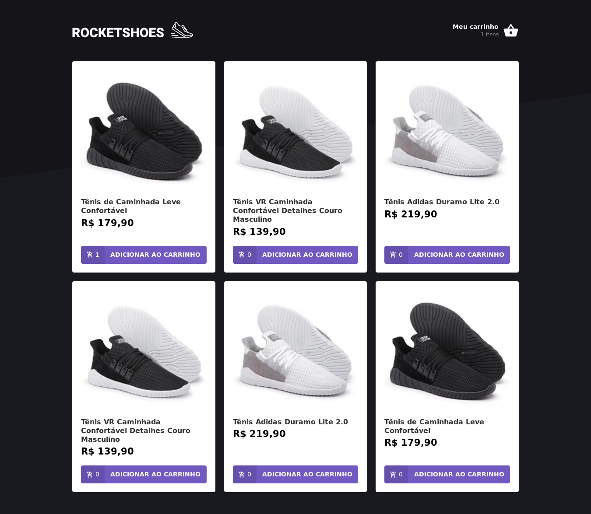
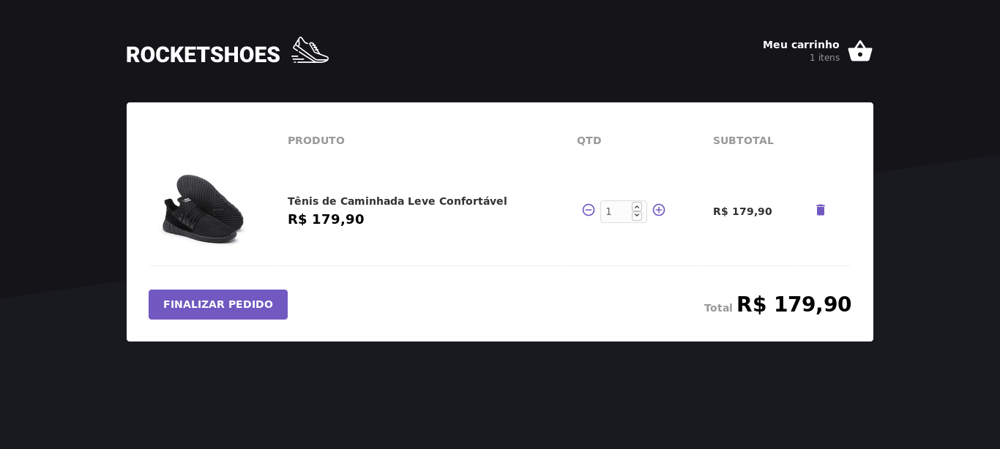

# RocketShoes

Sample store built with Redux and Redux-Saga 

:shoe:
:boot:
:sandal:
:high_heel:


<br>



```sh
cd loja

# start the json-server api
yarn start-api

# start the app on a new terminal window
yarn start
```

Runs the app in development mode.<br>
Open [http://localhost:3000](http://localhost:3000) to view it in the browser.